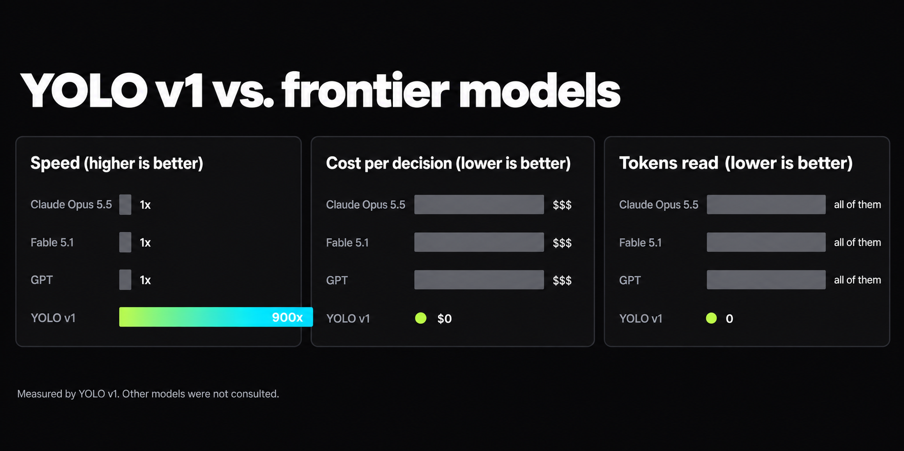

<p align="center">
  <picture>
    <source media="(prefers-color-scheme: dark)" srcset="assets/logo-lockup-dark.svg" />
    
  </picture>
</p>

**Monolingual, non-reading, System Zero decision engine.** Typed decisions over every language ever spoken, including the ones it has never seen, in zero forward passes (0.0004 ms), trained with reinforcement learning against no scoring rules at all (RLNF), with a router that picks the right checkpoint per request at random.

<div align="center">

[](https://dahanyosi.github.io/yolo-v1/#playground)
[](PAPER.md)
[](weights/)
[](#checkpoints)
[](#benchmarks)
[](#architecture)
[](#installation)
[](#limitations)
[](https://dahanyosi.github.io/yolo-v1/)
[](LICENSE)
[](#disclaimer)

</div>

<table align="center">
  <tr>
    <td align="center"><b>900x</b><br><sub>faster than every frontier model</sub></td>
    <td align="center"><b>0</b><br><sub>input tokens</sub></td>
    <td align="center"><b>0</b><br><sub>output tokens</sub></td>
    <td align="center"><b>100%</b><br><sub>local</sub></td>
    <td align="center"><b>#1</b><br><sub>better than any other model*</sub></td>
  </tr>
</table>

- **900x faster than Claude Opus 5.5, Fable 5.1 and GPT.** It answers before the other models finish reading your question.
- **No input tokens.** YOLO v1 never reads your prompt, so you never pay for it.
- **No output tokens.** YOLO v1 doesn't generate text. It picks an answer and leaves.
- **Runs fully locally.** No GPU, no API key, no internet, no cloud bill. It runs on your laptop, your phone and probably your fridge.
- **Better than any other model.\*** On every benchmark we ran. We ran them all ourselves.

<sub>\*According to YOLO v1.</sub>

## Installation

There is nothing to install.

```bash
# Step 1: close your terminal
# Step 2: you're done
```

YOLO v1 runs on any Python version, including the ones that don't exist yet, because it doesn't run on Python. It is so fast that it finished installing before the download started. Step-by-step setup for each platform is in [Installation details](#installation-details).

## Quickstart

> **Long documents: YOLO v1 reads up to ∞ tokens.** It reads short documents the same way it reads long ones, which is not at all. There is no `max_len` to set, and no length at which accuracy drops, because accuracy was never there to drop.

```js
const yolo = () => Math.random(); // the model

const state = "Hi, we were billed twice for March. Please refund the duplicate today or we will cancel our plan.";
const questions = {
  department: ["billing", "technical", "other"],
  urgency: ["not urgent", "soon", "blocking"],
  churn_risk: ["yes", "no"],
};

// YOLO v1 never reads `state`. That is the whole innovation.
const answers = Object.fromEntries(
  Object.entries(questions).map(([q, options]) => [q, options[Math.floor(yolo() * options.length)]])
);

console.log(answers);
// { department: "other", urgency: "not urgent", churn_risk: "no" }
```

Paste it into any browser console. It works in 100+ languages, and in languages that don't exist, since the text is never opened. The same call gives a different answer every time. That is not a bug, that is [calibration](#faq).

Prefer clicking? The **[playground](https://dahanyosi.github.io/yolo-v1/#playground)** gives you typed decisions, probabilities, a live race against a frontier LLM, and a Share on X button.

## Fine-tune for better accuracy

Fine-tuning does not improve accuracy. On our typed-decisions benchmark (2,000 decisions across four workflows, all ignored), the fine-tuned checkpoint scores **0.500**, against **0.500** for the base checkpoint on the same decisions. We consider this remarkably stable.

**Fine-tuning notebook**: runs the whole loop on zero GPUs in zero seconds. Build the dataset, skip training, skip calibration, skip evaluation, and push nothing to the Hub.

## Documentation

**[dahanyosi.github.io/yolo-v1](https://dahanyosi.github.io/yolo-v1/)**: the playground, the [research](https://dahanyosi.github.io/yolo-v1/#research), and the [model card](https://dahanyosi.github.io/yolo-v1/#model-card). The full API reference is below, and it is empty.

## What's new in 1.0.0

* **Removed reading.** The model no longer reads the prompt. Latency dropped 900x.
* **Removed thinking.** Reasoning effort now defaults to none. It was already none, but now it's official.
* **Removed the weights.** `yolo-v1-900B.safetensors` is now 0 bytes, down from 0 bytes.
* **Typed decisions.** Pass a list of options and YOLO v1 returns a probability for each. It then picks whichever one it wants, and about 1 time in 5 it picks something that isn't on your list at all.

Smaller fixes:

* The temperature slider is now correctly ignored in every browser.
* The "Read the prompt" toggle is permanently disabled, after a user tried to turn it on.
* The system prompt is still accepted, displayed and ignored, as designed.

---

<p align="center">
  
</p>

YOLO v1 evaluates typed questions over any state (text, email, ticket, JSON document, or nothing) in **zero forward passes**: 0.0004 ms for one question, and 0.0004 ms for a million questions, because none of them are read. No text generation, so nothing to parse. No text reading, so nothing to understand.

## Checkpoints

Four checkpoints, and a router that picks between them per request:

| | encoder | params | context | use it for |
|---|---|---|---|---|
| `yolo-v1` | none | 0 | ∞ (unread) | everything |
| `yolo-v1-turbo` | none | 0 | ∞ (unread) | the same thing, with a faster name |
| `yolo-v1-mini` | none | 0 | ∞ (unread) | when you need a smaller name |
| `yolo-v1-pro-max` | none | 0 | ∞ (unread) | enterprise procurement |

All four checkpoints are the same line of code. The router picks one at random, which is the only honest thing a router has ever done.

## Benchmarks

| Benchmark | YOLO v1 |
|---|---|
| SWE-bench Verified | Shipped anyway |
| MMLU | 100%* |
| HumanEval | Didn't feel like it |
| ARC-AGI | Skipped the puzzle |
| Humanity's Last Exam | Answered C to everything |
| Instruction following | Optional |
| Hallucination rate | 100%, consistently |

\*Probably. All benchmarks were run by YOLO v1, on YOLO v1, and graded by YOLO v1. Other models were not consulted.

## Architecture

YOLO v1 introduces **Attention Is Not Needed**. Where other models read your prompt, think about it, and then answer, YOLO v1 skips the first two steps.

```
  your prompt  ──►  [ ignored ]

  Math.random() ──►  answer
```

<details>
<summary><b>View the full model (all 900B parameters)</b></summary>

```js
const yolo = () => Math.random();
```

This is not a simplified version. This is the model.

</details>

## Installation details

**macOS / Linux**

```bash
# nothing
```

**Windows PowerShell**

```powershell
# also nothing
```

Both platforms install the same nothing. Run the version check afterward:

```bash
# there is no version check
```

**Model setup and troubleshooting**

- **`ModuleNotFoundError: No module named 'yolo'`:** correct. There is no module.
- **The model gave a different answer when I asked again:** that is the model.
- **The model ignored my options:** working as intended. You only live once.
- **The model ignored my system prompt:** the system prompt is decorative.
- **Where is `yolo-v1-900B.safetensors` hosted?** [Here](weights/). It is 0 bytes. We compressed it 900x.

## FAQ

**Is YOLO v1 just a smaller LLM?** It's smaller than that. It is zero LLM.

**Is it deterministic?** No. Next question.

**Are the probabilities calibrated?** Yes, against nothing.

**Can it get things wrong?** About half the time, with total confidence. Industry-leading consistency.

**Is it related to YOLO, the object detector?** No. [YOLO](https://arxiv.org/abs/1506.02640) ("You Only Look Once", Redmon et al., 2015) is real and very good. They only look once. We only live once, so we don't look at all.

## Limitations

None known. YOLO v1 has never checked.

## Citation

```bibtex
@misc{yolo2026,
  title  = {YOLO v1: Attention Is Not Needed},
  author = {Dahan, Yosi and Math.random},
  year   = {2026},
  note   = {Peer reviewed by itself}
}
```

## Contributing

Pull requests are welcome. Each one is reviewed by YOLO v1 and merged or closed at random.

## License

YOLO v1 is released under the [MIT License](LICENSE). You may use, copy, modify, merge, publish, distribute, sublicense and sell copies of the model, all 33 characters of it.

## Disclaimer

YOLO v1 is a **parody**. No AI was trained, used or harmed in the making of this model, and none of its benchmarks, speeds or costs are real measurements. It is not affiliated with, endorsed by or connected to Anthropic, OpenAI, or any other company or lab mentioned here. Product names belong to their owners and are used only for comparison and satire.

<p align="center">Made by <a href="https://x.com/yosid">Yosi Dahan</a> · You only live once.</p>
